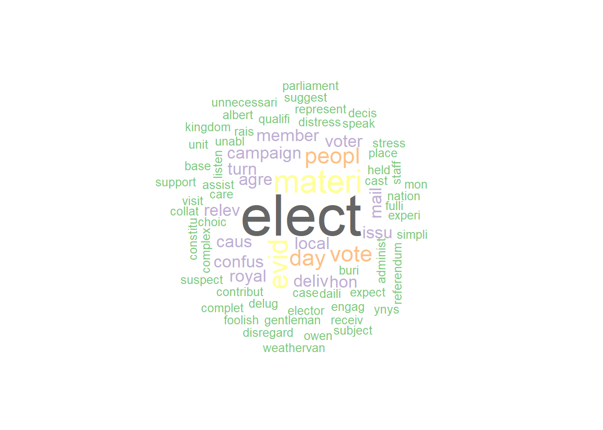
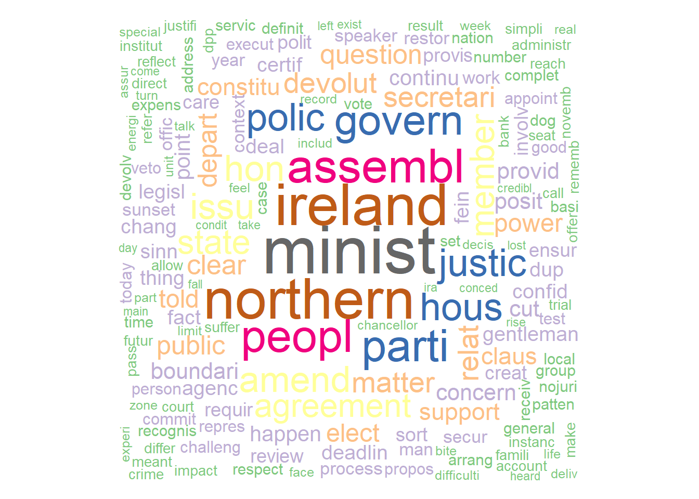
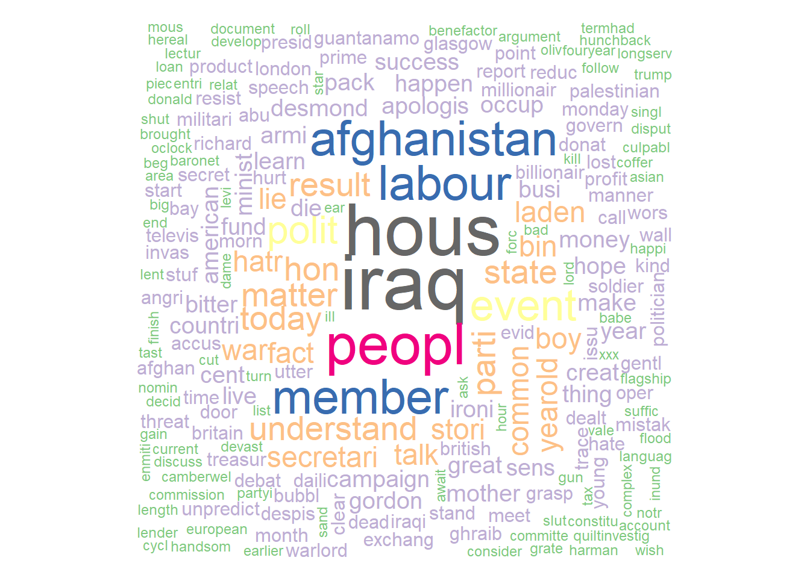

# 📊 Text Analytics of UK Parliamentary Speeches
### 🧠 Project Overview

This project applies text mining and natural language processing (NLP) techniques in R to analyze UK House of Commons speeches. The objective is to uncover linguistic patterns across political parties and test hypotheses related to gendered political discourse and thematic differences in debates.

### The study focuses on:

- Speech frequency patterns across parties
- Word usage differences (Labour vs Conservative MPs)
- Gendered language in political debates
- Word associations and semantic relationships
- Text preprocessing and corpus transformation
  
### Research Hypotheses

**The analysis tests the following hypotheses:**

- H1: Conservative women MPs initiate more debates than Labour women MPs.
- H2: Female Conservative MPs mention topics like sexual harassment, rape, and domestic violence more frequently, while Labour MPs focus more on equal pay, education, and parental leave.
- H3: Female Labour MPs are more likely to intervene in debates than female Conservative MPs.

### 📦 Libraries Used

`library(wordcloud)
library(RColorBrewer)
library(tm)
library(kableExtra)
library(readr)
library(ggplot2)
library(stringr)
library(tidyverse)
library(tidyselect)`

### 📁 Dataset

**Source:** UK House of Commons speech dataset
**Size:** ~2.3GB original dataset
**Sample used:** 10,000 speeches
**Period:** 2005–2010

### Key variables:
- speaker
- party
- text
- date
- speechnumber
- parliament
- iso3country
  
#### 🧹 Data Preprocessing

**Steps performed:**

- Sampling
`TextData <- TextData[sample(1:nrow(TextData), 10000),]`
- Missing value handling
- Dropped agenda (100% missing)
- Removed NA rows using drop_na()
- Feature engineering
`TextData$Text_Length <- nchar(TextData$text)`
- Text cleaning pipeline
  
#### Lowercasing

- Removing punctuation
- Removing numbers
- Removing stopwords (custom + standard lists)
  
### Stemming

- Stripping whitespace
  
```
Text_Corpus_Clean <- tm_map(Text_Corpus_Clean, removePunctuation)
Text_Corpus_Clean <- tm_map(Text_Corpus_Clean, removeNumbers)
Text_Corpus_Clean <- tm_map(Text_Corpus_Clean, stemDocument)
```

### 📊 Exploratory Data Analysis

## 📊 Party Distribution of Speeches

| Party        | Number of Speeches |
|--------------|--------------------|
| Labour       | 4938               |
| Conservative | 3281               |
| LibDem       | 1033               |
| SNP          | 111                |

#### Speech Length Distribution

- Most speeches are short
- Distribution is right-skewed
- Conservative and Labour MPs dominate long-form speeches
  
### ☁️ Word Cloud Analysis

Word clouds were generated for each party:

Conservative MPs
Labour MPs
LibDem MPs
SNP, DUP, and others




